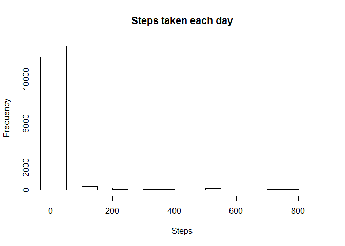
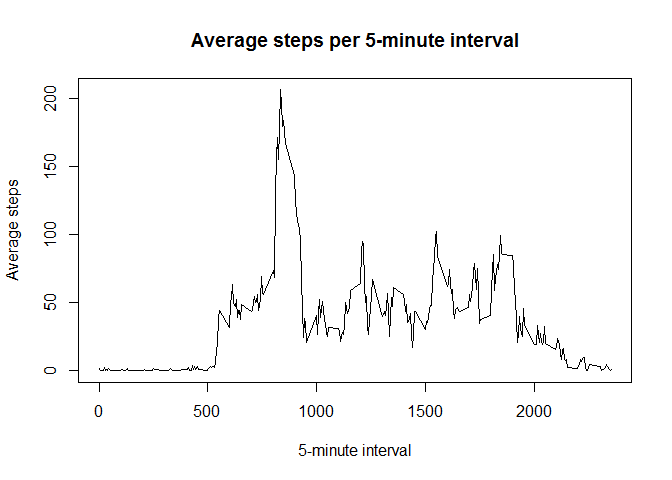
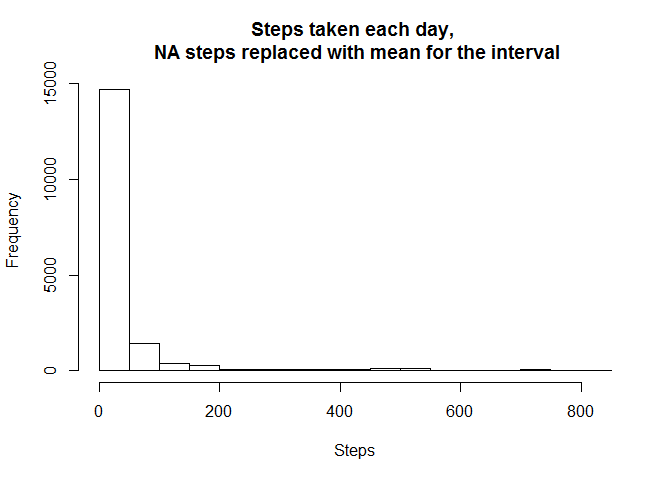
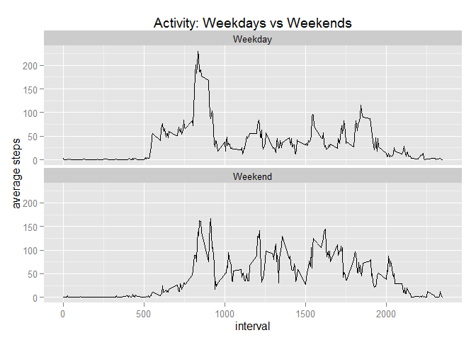

# Reproducible Research: Peer Assessment 1

#Initialization


```r
setInternet2(TRUE)
install.packages("ggplot2", repos='http://cran.us.r-project.org')
```

```
## Installing package into 'C:/Users/Peggy/Documents/R/win-library/3.1'
## (as 'lib' is unspecified)
```

```
## package 'ggplot2' successfully unpacked and MD5 sums checked
## 
## The downloaded binary packages are in
## 	C:\Users\Peggy\AppData\Local\Temp\RtmpYvQuls\downloaded_packages
```

```r
install.packages("dplyr", repos='http://cran.us.r-project.org')
```

```
## Installing package into 'C:/Users/Peggy/Documents/R/win-library/3.1'
## (as 'lib' is unspecified)
```

```
## package 'dplyr' successfully unpacked and MD5 sums checked
## 
## The downloaded binary packages are in
## 	C:\Users\Peggy\AppData\Local\Temp\RtmpYvQuls\downloaded_packages
```

```r
library(ggplot2)
library(dplyr)
```

```
## 
## Attaching package: 'dplyr'
## 
## The following objects are masked from 'package:stats':
## 
##     filter, lag
## 
## The following objects are masked from 'package:base':
## 
##     intersect, setdiff, setequal, union
```

## Loading and preprocessing the data

Read in Activity data from the URL.


```r
temp <- tempfile()
download.file("https://d396qusza40orc.cloudfront.net/repdata%2Fdata%2Factivity.zip",temp)
df <- read.csv(unz(temp, "activity.csv"))
unlink(temp)
dfNoNA <- na.omit(df) #remove NA records
```

## What is mean total number of steps taken per day?


```r
hist(dfNoNA$steps, main="Steps taken each day", xlab="Steps")
```

 

The mean steps per day is 37.3825996 but the median steps per day is 0.


## What is the average daily activity pattern?

Group and summarize data by interval to get the avg steps for each interval.


```r
dfGrp <- group_by(dfNoNA, interval)
dfIntMean <- summarize(dfGrp, mean=mean(steps))
```


```r
# Plot avg steps per interval
plot(dfIntMean, type="l", 
     xlab="5-minute interval",
     ylab="Average steps", 
     main="Average steps per 5-minute interval")
```

 

Get the Interval with the highest # of steps.


```r
dfMax <- as.data.frame(dfIntMean[order(-dfIntMean[,2]),])
```


Interval 835 has the highest number of steps which is 206.


## Imputing missing values

2304 records have missing steps.


Replace the missing steps with the mean steps for that interval over all days.


```r
dfNA <- filter(df, is.na(steps)) #only records w/ NA
dfMean <- merge(df, dfIntMean, by="interval") #merge original dataset with the Mean dataset
dfNAMean <- filter(dfMean, is.na(steps)) #Mean dataset w/ NA step records only
#replace NA steps with the mean rounded to an integer value
dfNAMean <- mutate(dfNAMean, steps=round(mean, 0))
#get recordset of NA replacement values in correct order for rbind
dfNAMean <- subset(dfNAMean, select = c(steps, date, interval))
dfAll <- rbind(dfNoNA, dfNAMean) #combine the 2 datasets
#order dataset by date and interval
dfSorted <- dfAll[order(dfAll[,2], dfAll[,3]),]
```

Histogram of the new dataset with NA values populated with the mean value for that interval.


```r
hist(dfSorted$steps, main="Steps taken each day, \n NA steps replaced with mean for the interval", xlab="Steps")
```

 

The mean steps per day is 37.3806922 and the median steps per day is 0.


## Are there differences in activity patterns between weekdays and weekends?


Add column for whether the date is a weekend or weekday.


```r
dfW <- mutate(dfSorted, day=weekdays(as.Date(date)))
dfW1 <- mutate(dfW, weekday=as.factor(ifelse(day %in% c('Saturday','Sunday'), 'Weekend', 'Weekday')))

#avg steps per weekday/weekend per interval
dfWGrp <- group_by(dfW1, weekday, interval)
dfWIntMean <- summarize(dfWGrp, mean=mean(steps))
```

Panel plot of the interval (x) and avg steps.


```r
ggplot(dfWIntMean, aes(interval, mean)) +
  geom_line() +
  facet_wrap(~weekday, nrow=2, ncol=1) + 
  labs(x="interval") +
  labs(y="average steps") +
  labs(title="Activity: Weekdays vs Weekends") 
```

 

